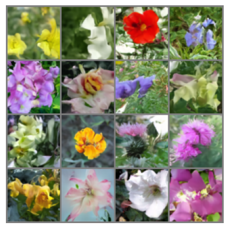

# DDPM
## Forward Process
* add noise step by step (from $x_{t-1}$ -> $x_{t}$)

$q(x_t|x_{t-1}) = N(x_t; \sqrt{1 - \beta_t} x_{t - 1} ,\sqrt{\beta_t}\epsilon_{t - 1})$

$x_t = \sqrt{1 - \beta_t} x_{t - 1} + \sqrt{\beta_t}\epsilon_{t - 1}$
* add noise with only one step, the core idea to merge two guassian random noise at time step i and i - 1 and recursivly to t=0.

$N(0, \sigma_1^2I) + N(0, \sigma_2^2I) = N(0, (\sigma_1^2 + \sigma_2^2)I)$

$q(x_t|x_0) = N(x_t; \sqrt{\hat{\alpha_t}}x_0, 1 - \hat{\alpha_t}I)$ 
in which $\alpha_t = 1 - \beta_t$, $\hat{\alpha_t} = \prod \limits_{t=1}^{t} \alpha_t$

we use this function to add noise to get $x_t$ at only one step. 

we design the $\beta_t$, so that, after a lot of time steps, the final $x_t$ would be a total guassian noise.

## backward process
after a lot of math, we can get

$p(x_{t - 1}| x_t) = N(x_t; \mu_\theta(x_t), \sigma^2 I)$

$\mu_\theta(x_t) = \frac{1}{\sqrt{\alpha_t}} (x_t - \frac{1 - \alpha_t}{\sqrt{1 - \hat{\alpha_t}}} \epsilon_{\theta}(x_t, t))$

$\epsilon_{\theta}$ is the model prediction, it should be equal to added noise, we use mse loss to optimize it.

use the function above, we can start from a random gussian noise, and iterativly use backward function to get less noisy image, and finally get a clean image.

## samples from this code

